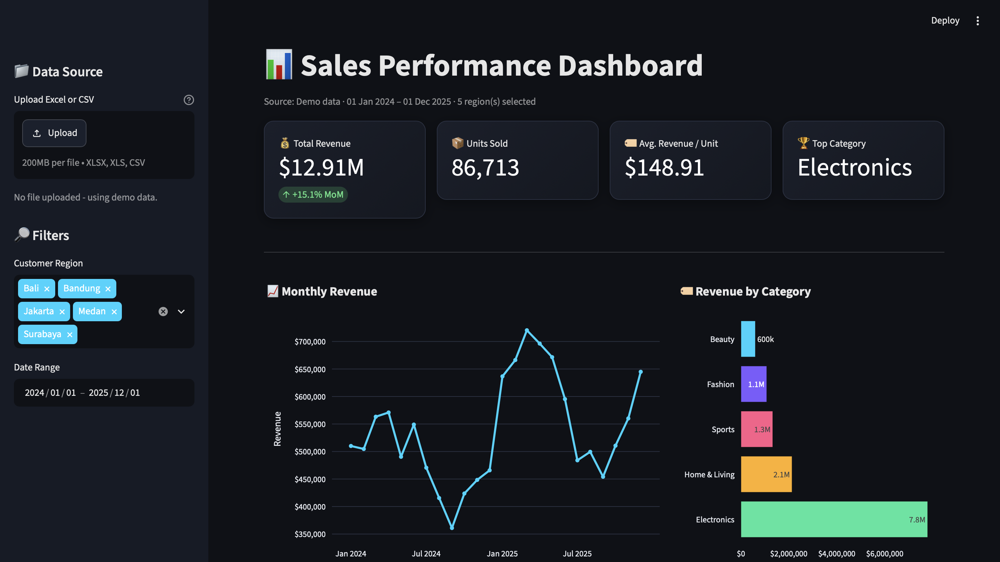
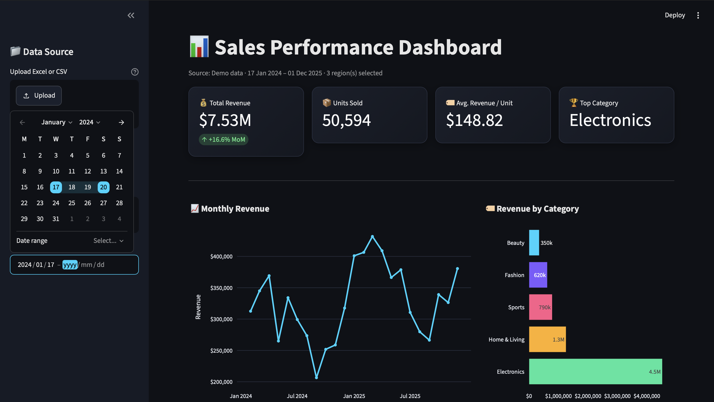

<h1 align="center">📊 Sales Performance Dashboard</h1>

  <b>Turn raw sales spreadsheets into a beautiful, interactive dark-mode dashboard in seconds.</b>

  
  
  
  
  
  

   
  <b>▶ <a href="https://matthew-sales-dashboard.streamlit.app">Try the live demo</a></b>: no install needed. It runs on dummy data, or you can upload your own Excel/CSV.

   
  <b>▶ <a href="https://matthew-sales-dashboard.streamlit.app">Try the live demo</a></b>: no install needed. It runs on dummy data, or you can upload your own Excel/CSV.

---

## 🚀 Value Proposition

Stop wasting hours building pivot tables and static charts: upload an Excel or CSV file and instantly get KPI cards, revenue trends, and category breakdowns you can filter by region and date. Built for business owners, sales teams, and analysts who need clear answers from their data without touching a line of code.

## ✨ Features

- 📁 **Upload your own data** - supports `.xlsx`, `.xls`, and `.csv`
- 🧪 **Instant demo mode** - realistic dummy sales data (with trend and seasonality) is generated automatically when no file is uploaded
- 💳 **KPI metric cards** - Total Revenue (with month-over-month growth), Units Sold, Avg. Revenue per Unit, Top Category
- 📈 **Monthly revenue line chart** - interactive hover, zoom, and pan
- 🏷️ **Category breakdown bar chart** - see which product lines drive revenue
- 🔎 **Sidebar filters** - filter by Customer Region and Date Range in real time
- ⬇️ **Export** - view and download the filtered dataset as CSV
- 🌙 **Dark theme** - polished, modern UI out of the box
- 🧩 **Modular code** - clean, single-purpose functions that are easy to extend

## 🧰 Tech Stack

| Tool | Purpose |
| --- | --- |
| [Python 3.9+](https://www.python.org/) | Core language |
| [Streamlit](https://streamlit.io/) | Web app framework and UI |
| [pandas](https://pandas.pydata.org/) | Data loading, cleaning, and aggregation |
| [Plotly Express](https://plotly.com/python/plotly-express/) | Interactive charts |
| [openpyxl](https://openpyxl.readthedocs.io/) | Excel file support |

## ⚡ Quickstart

**1. Clone the repo**

~~~bash
git clone https://github.com/matthewdotcom/sales-dashboard.git
cd sales-dashboard
~~~

**2. Create a virtual environment and install dependencies**

~~~bash
python3 -m venv .venv
source .venv/bin/activate      # Windows: .venv\Scripts\activate
pip install -r requirements.txt
~~~

**3. Launch the dashboard**

~~~bash
streamlit run app.py
~~~

Your browser opens automatically at `http://localhost:8501`.

## 📄 Using Your Own Data

Upload an Excel or CSV file from the sidebar with these columns:

| Date | Category | Revenue | Units Sold | Customer Region |
| --- | --- | --- | --- | --- |
| 2025-01-01 | Electronics | 54000 | 120 | Jakarta |
| 2025-01-01 | Fashion | 7200 | 120 | Bandung |

Invalid rows are cleaned automatically. If the file is missing a required column, the app shows a clear error and falls back to demo data.

## 🖼️ Screenshots

> _Add your screenshots here._

| Dashboard Overview | Filters & Data Export |
| --- | --- |
|  |  |

## 🗂️ Project Structure

~~~text
.
├── .streamlit/
│   └── config.toml     # Dark theme configuration
├── app.py              # Dashboard: data loading, filters, KPIs, charts
├── requirements.txt    # Python dependencies
└── README.md
~~~

## 🛣️ Roadmap

- [ ] Region-level map visualization
- [ ] Year-over-year comparison view
- [ ] One-click deploy to Streamlit Community Cloud

## 🤝 Contributing

Pull requests are welcome. For major changes, please open an issue first to discuss what you would like to change.

## 📄 License

[MIT](LICENSE)
